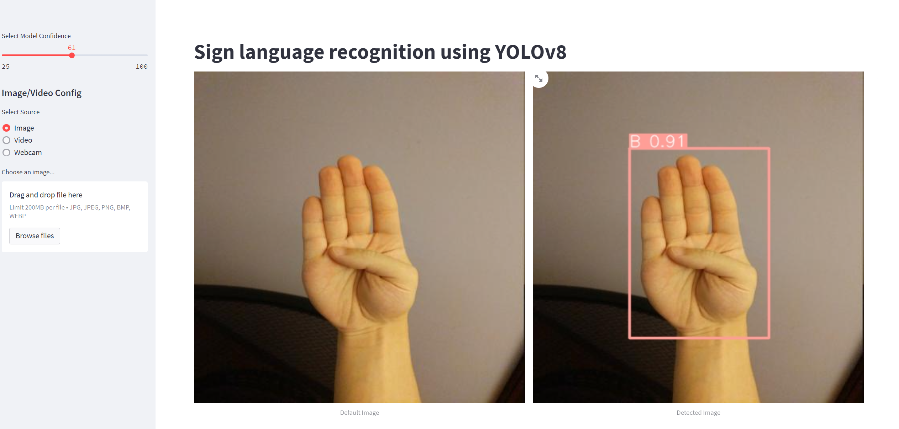

# Sign Language Recognition using YOLOv8

The project aims to create a system to understand sign language gestures. It uses a robust algorithm called [YOLOv8](https://github.com/ultralytics/ultralytics) to detect and interpret these gestures in real-time.


## Dataset
The American Sign Language Letters Dataset used was obtained from [roboflow ](https://public.roboflow.com/). it contains 1728 images 

## Model
yolo8n.pt was used to train the data for 100 epochs .if you want to retrain the model run the command
```bash
  python train.py
```
and after training you will find a new folder named runs
inside that path runs/train/weights you will find best.pt copy it to weights folder.
## Run Locally
Clone the project

```bash
  git clone https://github.com/Mariam111/Sign-Language-Recognition
```

Go to the project directory

```bash
  cd Sign-Language-Recognition
```

Install dependencies

```bash
  pip install -r requirements.txt
```

Start the server

```bash
  python -m streamlit run app.py
```


## Demo

https://drive.google.com/drive/folders/1ABQgB4ffNWWg5p-wrRbjfbAAjWF-rsmn


## Screenshots




## Author

- [Mariam Gamal](https://github.com/Mariam111)


## Contributing

Contributions are always welcome!
